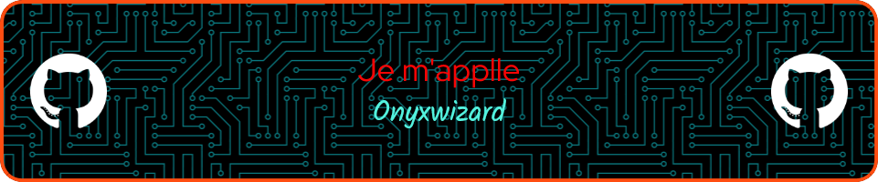

<!-- BANNER -->

  

 

I’m a passionate developer and cybersecurity enthusiast building my way through Python scripts, full-stack apps, and network security concepts. 💻⚡

🔧 *Currently focused on:*  
- Full Stack Development  
- Cybersecurity & Ethical Hacking  
- Python Automation  

🧠 *Learning:*  
 REST APIs • Encryption • CTFs • DevOps Tools

## 📊 My GitHub Stats

  
  

 

## 🧪 What is This Repo?

This is my personal collection of **projects**, **scripts**, and **experiments** across various domains including:

- 🧑‍💻 Frontend Web Development  
- 🛠️ Backend Systems  
- 🌐 Full-Stack Applications  
- 🔐 Cybersecurity Concepts  
- 🤖 AI/ML Models  
- 🐍 Python Scripts  
- ☁️ DevOps & Cloud Tools  

📁 The repo is organized by **technology stack** and **domain**, making it easy to navigate and explore specific areas of interest.

## 📁 Folder Structure

Each section corresponds to a folder in this repo containing related projects.

| Section           | Description                              | Folder Path             |
|-------------------|------------------------------------------|-------------------------|
| 🧑‍💻 Frontend     | UI-focused web development               | `/frontend/`             |
| 🛠️ Backend        | Server-side logic and APIs               | `/backend/`              |
| 🌐 Full-Stack      | Complete applications                    | `/full-stack/`           |
| 🔐 Cybersecurity   | Security tools, CTFs, encryption         | `/cybersecurity/`        |
| 🤖 AI / ML         | Machine learning & data science          | `/ai-ml/`                |
| ☁️ DevOps / Cloud  | CI/CD, Docker, Infrastructure            | `/devops-cloud/`         |
| 🐍 Python Scripts  | CLI tools, automation, utilities         | `/python-scripts/`       |
| 💾 Databases       | SQL, NoSQL, ORM experiments              | `/databases/`            |
| 📦 Others          | Hybrid or experimental projects          | `/others/`               |

📌 Each project should have its own `README.md` with setup instructions, purpose, and screenshots where applicable.

## 🧰 My Tech Stack

Here’s what powers most of my work:

| Category       | Tools & Technologies                     |
|----------------|------------------------------------------|
| **Languages**  | Python 🐍, JavaScript 🧠, HTML/CSS 💡     |
| **Frontend**   | React ⚛️, TailwindCSS, Bootstrap, Vue     |
| **Backend**    | Flask ⚙️, Django, Express.js 🚀, Node.js  |
| **Databases**  | PostgreSQL, MySQL, MongoDB 🛢️            |
| **DevOps**     | Docker 📦, GitHub Actions, AWS ☁️         |
| **Security**   | Nmap, Wireshark, Burp Suite 🔍           |

## 📈 GitHub Insights

📊 Want to see how I code, commit, and contribute over time?  
Check out the [Insights tab](https://github.com/onyxwizard/projects/graphs) on this repository!

<!-- ## 🔥 Pinned Projects

Here are some of my favorite projects from this repo:

- [Cybersecurity Toolkit](https://github.com/onyxwizard/projects/tree/main/cybersecurity/toolkit)  
  ➤ A custom Python-based scanner and analyzer using sockets and OS tools.

- [Portfolio Website](https://github.com/onyxwizard/projects/tree/main/frontend/portfolio)  
  ➤ A responsive, modern portfolio built with React and TailwindCSS.

- [Flask Auth API](https://github.com/onyxwizard/projects/tree/main/backend/flask-auth-api)  
  ➤ RESTful authentication system with JWT and PostgreSQL.

- [Python Automation Scripts](https://github.com/onyxwizard/projects/tree/main/python-scripts)  
  ➤ Includes file organizer, web scraper, QR code generator, and more. -->

## 🧩 Contributing

Contributions are welcome! If you'd like to improve any part of this repo, feel free to open an issue or submit a pull request.

## 📬 Let's Connect

- 🐙 **GitHub**: [@onyxwizard](https://github.com/onyxwizard)
- 📝 **Blog / Medium**: [onyxwizard](https://onyxwizard.medium.com/)

💬 Got ideas? Questions? DMs are always open.