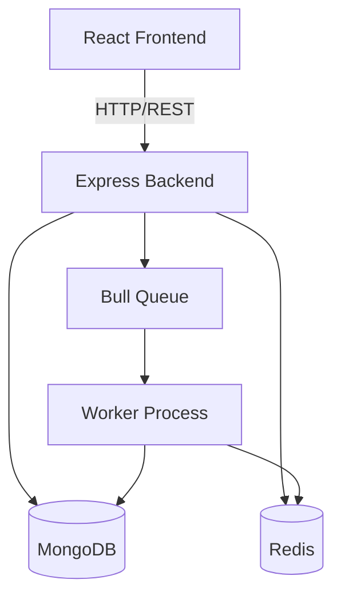

# 🚀 Supplier Price Catalog Manager

[](https://mongodb.com)
[](https://expressjs.com)
[](https://reactjs.org)
[](https://nodejs.org)
[](https://jwt.io)
[](https://redis.io)
[](https://github.com/OptimalBits/bull)
[](LICENSE)

A **full‑stack, multi‑tenant SaaS application** that lets suppliers upload product price lists (CSV) and automatically reconcile them with their existing catalog. Built with the MERN stack + Redis/Bull for background processing. 🛠️


## 📋 Table of Contents
- [Overview](#-overview)
- [✨ Features](#-features)
- [🏗️ Architecture](#️-architecture)
- [⚙️ Backend Details](#️-backend-details)
  - [📦 Data Models](#-data-models)
  - [🔐 Authentication & Authorization](#-authentication--authorization)
  - [📡 API Endpoints](#-api-endpoints)
  - [📤 File Upload & CSV Parsing](#-file-upload--csv-parsing)
  - [🧠 Comparison Algorithm](#-comparison-algorithm)
  - [⏳ Asynchronous Processing](#-asynchronous-processing)
  - [📈 Indexing & Performance](#-indexing--performance)
- [💻 Frontend Details](#-frontend-details)
  - [🔑 Authentication Context](#-authentication-context)
  - [📁 Components](#-components)
  - [🔄 Job Status Polling](#-job-status-polling)
  - [📄 Pagination](#-pagination)
- [⚡ Setup & Installation](#-setup--installation)
- [🔧 Environment Variables](#-environment-variables)
- [🎮 Usage](#-usage)
- [🧪 Testing](#-testing)
- [🔮 Future Improvements](#-future-improvements)
- [📄 License](#-license)


## 🌟 Overview
Suppliers often need to update their product catalogs with new prices or items. This platform provides a **secure, scalable** way to upload CSV price lists, automatically compare them with existing data, and receive a detailed summary of changes – all while keeping the UI responsive through **background processing**. 📈


## ✨ Features
- ✅ **Supplier registration & login** with JWT‑based authentication.
- 🔒 **Multi‑tenancy**: Each supplier’s data is completely isolated.
- 📤 **CSV upload** with streaming parsing (handles large files efficiently).
- 🧠 **Intelligent comparison** using a Map‑based algorithm to detect:
  - 🆕 New products
  - 💲 Price changes
  - ✅ Exact matches
  - 🗑️ Discontinued items
- ⚡ **Asynchronous processing** via Bull and Redis – uploads return immediately with a `jobId`; the client polls for the result.
- 📡 **RESTful API** with pagination for product listings.
- 🖥️ **React frontend** with:
  - 🛡️ Protected routes
  - 🌍 Global authentication state (Context API)
  - 🔄 Real‑time job status polling
  - 📋 Paginated product table
- 🛡️ **Comprehensive error handling** and input validation.
- 🚀 **Optimized database queries** with proper indexing.


## 🏗️ Architecture


- **Frontend**: React app (port 3000) communicates with the backend API.
- **Backend**: Express server (port 5000) handles auth, CRUD, and queues upload jobs.
- **Database**: MongoDB stores supplier and product data.
- **Queue**: Redis + Bull manage background job processing.

---

## ⚙️ Backend Details

### 📦 Data Models
**Supplier** (`models/Supplier.js`)
```javascript
const supplierSchema = new mongoose.Schema({
  name: String,
  email: { type: String, unique: true },
  password: String
});
```

**Product** (`models/Product.js`)
```javascript
const productSchema = new mongoose.Schema({
  supplier: { type: mongoose.Schema.Types.ObjectId, ref: 'Supplier', required: true },
  sku: String,
  name: String,
  price: Number,
  category: String
}, { timestamps: true });

productSchema.index({ supplier: 1, sku: 1 }, { unique: true });
productSchema.index({ supplier: 1, createdAt: -1 });
```

### 🔐 Authentication & Authorization
- Passwords hashed using **bcryptjs** (pre‑save hook).
- JWT tokens issued on register/login (expires in 7 days).
- `protect` middleware verifies token and attaches supplier to `req`.

### 📡 API Endpoints

| Method | Endpoint                 | Description                          | Auth  |
|--------|--------------------------|--------------------------------------|-------|
| POST   | `/api/auth/register`     | Register new supplier                | ❌    |
| POST   | `/api/auth/login`        | Login supplier                       | ❌    |
| GET    | `/api/auth/profile`      | Get current supplier profile         | ✅    |
| GET    | `/api/products`          | Get paginated products               | ✅    |
| POST   | `/api/products`          | Create a single product (test only)  | ✅    |
| POST   | `/api/upload`            | Upload CSV price list                | ✅    |
| GET    | `/api/upload/status/:id` | Get job status & result              | ✅    |

### 📤 File Upload & CSV Parsing
- Uses **Multer** with memory storage (10MB limit).
- File buffer converted to stream and piped through **csv-parser**.
- Each row validated: `sku`, `name`, `price` required; `price` must be numeric.
- Invalid rows collected and returned as `400` (or job failure).

### 🧠 Comparison Algorithm
```javascript
// Fetch existing products (lean for speed)
const existing = await Product.find({ supplier: id }, 'sku price').lean();
const existingMap = new Map(existing.map(p => [p.sku, p]));

const processedSkus = new Set();
for (const item of uploaded) {
  processedSkus.add(item.sku);
  const old = existingMap.get(item.sku);
  if (!old) newProducts.push(item);
  else if (old.price !== item.price) priceChanges.push(item);
  else matches.push(item.sku);
}
const discontinued = existing.filter(p => !processedSkus.has(p.sku));
```
- **Time complexity**: O(n+m) vs O(n·m) with nested loops.
- **Memory efficient**: only SKU and price stored in Map.

### ⏳ Asynchronous Processing
- **Bull** queue (`upload processing`) with Redis backend.
- Upload endpoint queues job and immediately returns `202 Accepted` + `jobId`.
- Worker processes job: parses CSV, runs comparison, updates DB.
- Status endpoint (`GET /upload/status/:jobId`) returns job state, progress, and result.
- Jobs retained after completion (`removeOnComplete: false`) for client retrieval.

### 📈 Indexing & Performance
- Compound unique index on `{ supplier:1, sku:1 }` prevents duplicates.
- Index on `{ supplier:1, createdAt:-1 }` speeds up paginated product lists.
- Index on `{ supplier:1 }` for count queries.
- `.lean()` used in read‑only queries to reduce overhead.

---

## 💻 Frontend Details

Built with **React 18**, **React Router v6**, and **Axios**.

### 🔑 Authentication Context
- `AuthContext` provides `user`, `login`, `register`, `logout` globally.
- Token stored in `localStorage` and automatically attached to all Axios requests via interceptor.
- Protected routes redirect unauthenticated users.

### 📁 Components
- **`Login` / `Register`**: Simple forms with validation.
- **`Dashboard`**: Main view after login; contains `Upload` and `ProductList`.
- **`Upload`**:
  - File input + submit button.
  - Displays upload status.
  - Polls job status endpoint until completion (every 2 seconds).
  - Shows summary result.
- **`ProductList`**:
  - Fetches paginated products using `useEffect` on page change.
  - Displays table with SKU, name, price, category.
  - Pagination controls (Previous/Next) with current page info.
- **`ProtectedRoute`**: Wrapper for routes that require authentication.

### 🔄 Job Status Polling
```javascript
const pollJobStatus = (jobId) => {
  const interval = setInterval(async () => {
    const res = await axios.get(`/upload/status/${jobId}`);
    if (res.data.state === 'completed') {
      setSummary(res.data.result.summary);
      clearInterval(interval);
    }
  }, 2000);
};
```

### 📄 Pagination
- Backend supports `?page` and `?limit` query params.
- Frontend stores `page` state and updates on button clicks.
- `totalPages` from API disables buttons at boundaries.

---

## ⚡ Setup & Installation

### Prerequisites
- Node.js (v18+)
- MongoDB (local or Atlas)
- Redis (local or Docker)

### Clone & Install
```bash
git clone https://github.com/yourusername/supplier-price-catalog.git
cd supplier-price-catalog
```

#### Backend
```bash
cd backend
npm install
cp .env.example .env   # Edit with your values
npm run dev            # Starts server on http://localhost:5000
```

#### Worker (separate terminal)
```bash
cd backend
node workers/uploadWorker.js
```

#### Frontend
```bash
cd frontend
npm install
cp .env.example .env   # Set REACT_APP_API_URL=http://localhost:5000/api
npm start              # Starts on http://localhost:3000
```

---

## 🔧 Environment Variables

### Backend (`.env`)
| Variable     | Description                          | Default               |
|--------------|--------------------------------------|-----------------------|
| `PORT`       | Server port                          | `5000`                |
| `MONGO_URI`  | MongoDB connection string            | `mongodb://127.0.0.1:27017/supplier_catalog` |
| `JWT_SECRET` | Secret for signing JWT               | `your_jwt_secret`     |
| `REDIS_HOST` | Redis host                           | `127.0.0.1`           |
| `REDIS_PORT` | Redis port                           | `6379`                |

### Frontend (`.env`)
| Variable             | Description               | Default                     |
|----------------------|---------------------------|-----------------------------|
| `REACT_APP_API_URL`  | Backend API base URL      | `http://localhost:5000/api` |

---

## 🎮 Usage
1. **Register** as a new supplier.
2. **Login** – you'll be redirected to the dashboard.
3. **Upload a CSV** (use the sample below).
4. Watch the status update – once completed, the summary appears.
5. Browse your products using the paginated table.

### Sample CSV (`prices.csv`)
```csv
sku,name,price,category
P001,Wireless Mouse,25.99,Electronics
P002,Mechanical Keyboard,89.50,Electronics
P003,Desk Lamp,34.20,Home
```


## 🧪 Testing
- **Backend**: Use Postman or Thunder Client to test endpoints.
- **Frontend**: Manually test flows; check browser console for errors.
- **Edge cases**: Empty file, malformed CSV, duplicate SKUs, missing fields.
- **Performance**: Upload a 10,000‑row CSV to verify async handling.


## 🔮 Future Improvements
- 📧 Email notifications when background jobs complete.
- 📊 Real‑time progress via WebSockets (instead of polling).
- ♻️ Soft delete for discontinued products (add `isActive` flag).
- 📦 Pagination with cursor‑based approach for very large datasets.
- 🧪 Unit & integration tests with Jest / React Testing Library.
- 🚀 Deploy to cloud (Render for backend, Netlify for frontend).


## 📄 License
This project is licensed under the MIT License – see the [LICENSE](LICENSE) file for details.


**Built with ❤️ by `onyxwizard`**